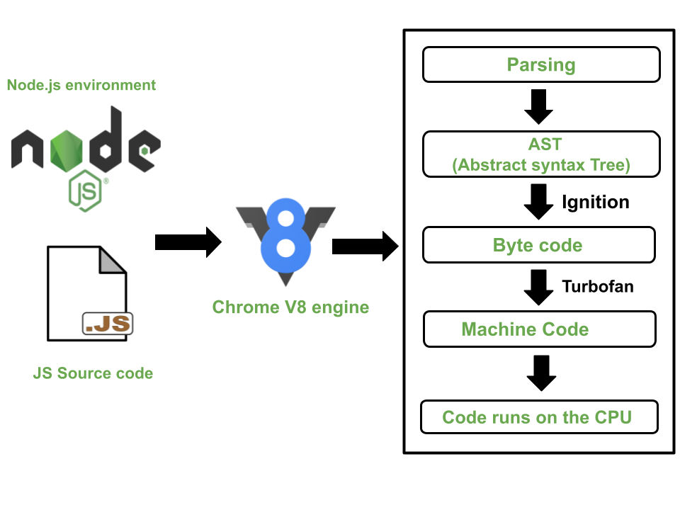

# Contents

- [HTML Parsing](#html-parsing)
  - [HTML Source Code Arrives](#1-html-source-code-arrives)
  - [Tokenization](#2-tokenization)
  - [DOM Tree Construction](#3-dom-tree-construction)
- [Script Handling](#script-handling)
  - [Normal `<script>`](#normal-script)
  - [`<script defer>`](#script-defer)
  - [`<script async>`](#script-async)
  - [Multiple Script Handling](#multiple-script-handling)
- [Babel](#babel)
  - [Why Babel Is Needed](#why-babel-is-needed)
  - [What Is Babel](#what-is-babel)
  - [Installation](#installation)
  - [How Babel Works](#how-babel-works)
- [Bundler](#bundler)
  - [Why We Need Bundler](#why-we-need-bundler)
  - [Major JavaScript Bundlers](#major-javascript-bundlers)
  - [webpack](#webpack)
    - [Installation](#installation-1)
    - [How It Works](#how-babel-works)

# HTML Parsing

HTML parsing is the process by which the browser reads your raw HTML text (.html file) and converts it into a structured, in-memory representation called the DOM (Document Object Model).

## 1. HTML Source Code Arrives

When you open a webpage, the browser downloads the HTML file from the server.

```html
<!DOCTYPE html>
<html>
  <head>
    <title>My Page</title>
  </head>
  <body>
    <h1>Hello</h1>
    <p>Welcome to HTML parsing!</p>
  </body>
</html>
```

This is plain text — not yet structured or rendered.

## 2. Tokenization

The browser’s HTML parser starts reading this text character by character.

It breaks it into tokens — each representing an HTML construct:

- Start tags (`<html>`, `<body>`)
- End tags (`</body>`)
- Text nodes (`Hello, Welcome...`)
- Comments, attributes, etc.

```html
< !DOCTYPE html >
< html >
< head >
< title >
My Page
</ title >
< body >
< h1 >
Hello
</ h1 >
...
```

## 3. DOM Tree Construction

As the tokens are recognized, the browser creates nodes and connects them hierarchically to build the DOM tree.

```
Document
└── html
    ├── head
    │   └── title: "My Page"
    └── body
        ├── h1: "Hello"
        └── p: "Welcome to HTML parsing!"
```

- A tree structure representing all elements and their relationships.
- JavaScript and CSS interact with this tree.

# Script Handling

## Normal `<script>`

```html
<script src="normal.js"></script>
```

The parser pauses:

- Fetches and executes `normal.js`
- Only then continues parsing HTML below

This is why `<script>` tags often go at the end of `<body>` — to avoid blocking HTML parsing.

## `<script defer>`

```html
<script src="defer.js" defer></script>
```

- Parser continues parsing HTML (non-blocking)
- Script is executed after HTML parsing is complete

## `<script async>`

```html
<script src="main.js" async></script>
```

- Script is downloaded in parallel
- Executes as soon as it’s ready
- Might execute before or after parsing finishes

## Multiple Script Handling

When you include multiple scripts using `<script>` tags without `type="module"`,
all of them run in the same global scope (the `window` object in browsers).

```html
<script src="./js/src/declare.js"></script>
<script src="./js/src/index.js"></script>
```

Scripts are executed in the order they appear in the HTML (unless using `async` or `defer`).

Multiple file share data which are in the same global scope, but the run independently.

**When Scripts Do NOT Share Data**

If you use the module system (i.e., `<script type="module">`),
each file runs in its own module scope, not the global scope.

```html
<script type="module" src="./js/src/declare.js"></script>
<script type="module" src="./js/src/index.js"></script>
```

- When we want to use `import`/`export` we have to use `type="module"`

# Babel

## Why Babel Is Needed

Imagine you're targeting both modern browsers and Internet Explorer (which doesn't support ES6 or modern features)

### Without Babel

```html
<script>
  const greet = (name) => `Hello, ${name}`;
  console.log(greet("Alice"));
</script>
```

- Modern browsers: It will run just fine.
- IE 11: Throws an error because it doesn’t recognize arrow functions.

### With Babel (After Transpilation)

```html
<script>
  var greet = function greet(name) {
    return "Hello, " + name;
  };
  console.log(greet("Alice"));
</script>
```

- Modern browsers: It still works perfectly (Babel just ensures compatibility).
- IE 11: It runs without errors because Babel has converted the arrow function into a regular function.

## What Is Babel

Babel is a JavaScript compiler (transpiler) that allows developers to write modern JavaScript (ES6+ or newer) and convert it into older versions (like ES5) so that it can run in environments (like older browsers or Node.js versions) that don’t yet support the latest features.

Think of Babel as a translator that takes your "new language" (modern JavaScript) and converts it into an "old language" (JavaScript that all browsers understand).

## Installation

1. Install Babel

   ```bash
   npm init -y
   npm install --save-dev @babel/core @babel/cli @babel/preset-env
   ```

2. Create Babel config file (`babel.config.json`)

   ```json
   {
     "presets": ["@babel/preset-env"]
   }
   ```

3. Run Babel

   ```bash
   npx babel js/src --out-dir js/dist
   ```

This compiles all files from `src/` to `dist/`.

## Babel Presets & Plugins

- Presets = groups of plugins.
  - `@babel/preset-env – Transpile ES6+`
  - `@babel/preset-react – For JSX (React)`
  - `@babel/preset-typescript – For TypeScript`
- Plugins = individual transformations.
  - `@babel/plugin-proposal-optional-chaining`
  - `@babel/plugin-transform-arrow-functions`

## How Babel Works

When you run Babel on a file, it goes through three main phases:

1. Parsing (Code → AST)
2. Transforming (AST → Modified AST)
3. Code Generation (Modified AST → Code)

This pipeline is very similar to how compilers work, but Babel is a transpiler (source-to-source compiler).

### 1. Parsing (Code → AST)

Parsing happens in two sub-steps:

#### 1. Lexical Analysis (Tokenization)

The input JavaScript code is split into tokens (smallest units like `const`, `=`, `(`, `)`, `{`, `}`).

```js
const firstName = "Masum";
const lastName = "Billah";
```

Tokens might look like:

```js
[
  { type: "Keyword", value: "const" },
  { type: "Identifier", value: "firstName" },
  { type: "Punctuator", value: "=" },
  { type: "String", value: "Masum" },
  { type: "Punctuator", value: ";" },
  { type: "Keyword", value: "const" },
  { type: "Identifier", value: "lastName" },
  { type: "Punctuator", value: "=" },
  { type: "String", value: "Billah" },
  { type: "Punctuator", value: ";" },
];
```

#### 2. Syntactic Analysis

Next, Babel transforms these tokens into an Abstract Syntax Tree (AST). The AST is a tree structure that represents the syntax of the code.

For the two variable declarations:

```json
{
  "type": "VariableDeclaration",
  "kind": "const",
  "declarations": [
    {
      "type": "VariableDeclarator",
      "id": { "type": "Identifier", "name": "firstName" },
      "init": { "type": "Literal", "value": "Masum" }
    },
    {
      "type": "VariableDeclarator",
      "id": { "type": "Identifier", "name": "lastName" },
      "init": { "type": "Literal", "value": "Billah" }
    }
  ]
}
```

Babel uses `@babel/parser` to do this job.

### 2. Transforming (AST → Modified AST)

Now, Babel applies transformations based on the plugins and presets you have in your configuration. However, since there’s no modern syntax to transform in this simple example, we’re essentially working with no-op transformations.

#### Example Transformation

If there were transformations (like changing `const` to `var`, or converting arrow functions), Babel would modify the AST. For this case, no such transformation is needed, so the AST remains the same.

For example, if you had a transformation to convert `const` to `var`, Babel would modify the AST as follows:

Original AST (simplified):

```json

{
  "type": "VariableDeclaration",
  "kind": "const",  // To be transformed to 'var'
  "declarations": [ ... ]
}
```

Transformed AST:

```json
{
  "type": "VariableDeclaration",
  "kind": "var",  // After transformation from 'const' to 'var'
  "declarations": [ ... ]
}
```

**Used Tool**

- This is where `@babel/traverse` and plugins work:
- `@babel/plugin-transform-arrow-functions` sees `ArrowFunctionExpression` nodes.
- Rewrites them as `FunctionExpression` nodes.

### 3. Code Generation (Modified AST → Code)

Finally, after Babel processes the AST and applies the necessary transformations, it generates the final JavaScript code.

If there were no transformations, the output would look like this:

```js
const firstName = "Masum";
const lastName = "Billah";
```

If Babel had transformed the `const` declarations into `var`, the generated code would look like this:

```js
"use strict";

var firstName = "Masum";
var lastName = "Billah";
```

- `"use strict"` is added automatically by Babel for better error handling.
- `const` is converted to `var`, which is supported by older browsers like Internet Explorer 11.

**Used Tool**

- `@babel/traverse` → Walks through AST nodes
- `@babel/types` → Helpers for building/modifying AST nodes
- `@babel/generator` → Turns AST back into code
- `@babel/core` → Orchestrates everything

# Bundler

## Why We Need Bundler

### Optimizing Multiple Files into One File

In a modern web application, you often have many small files (JavaScript, CSS, images, etc.). Without a bundler, you'd have to manually load each of them into your HTML file:

```html
<script src="index.js"></script>
<script src="utils.js"></script>
<script src="app.js"></script>
<!-- CSS files -->
<link rel="stylesheet" href="style.css" />
<link rel="stylesheet" href="theme.css" />
```

This leads to:

- Multiple HTTP requests for each file (which can slow down the page load time).
- Harder to manage dependencies across various files

A bundler solves this by combining everything into a single file (or few files) for efficient loading:

```html
<script src="bundle.js"></script>
<link rel="stylesheet" href="styles.css" />
```

### Handling Dependencies (Module System)

Modern JavaScript development often involves breaking up code into modules using ES6 imports/exports or CommonJS modules. Without a bundler, you’d have to include every file manually, which becomes complex when you have hundreds of files.

In this case, you'd need a bundler like Webpack to:

- Resolve all dependencies automatically.
- Combine all modules into a single file.

### Support for Non-JavaScript Files

A bundler isn’t just for JavaScript — it can also handle other assets like CSS, images, fonts, etc. For instance, you might want to include a `.scss` file (Sass), which is not natively understood by browsers.

```css
/* styles.scss */
$primary-color: blue;
body {
  background-color: $primary-color;
}
```

A bundler like Webpack or Parcel can automatically:

1. Compile SCSS into regular CSS.
2. Inline images or fonts into your code using Base64 encoding.

## Major JavaScript Bundlers

| Bundler     | Key Strength                                   | Used By                                |
| ----------- | ---------------------------------------------- | -------------------------------------- |
| **Webpack** | Highly configurable and powerful               | React, Angular, enterprise apps        |
| **Vite**    | Super fast development (uses ES modules & HMR) | Vue, React, Svelte, modern frameworks  |
| **Parcel**  | Zero-config, beginner friendly                 | Small to medium projects, static sites |

## webpack

Webpack is a module bundler for JavaScript applications.

- It takes your application (written in modules like JS, CSS, images, etc.).
- Resolves all dependencies.
- Bundles everything into one or more output files (usually bundle.js).
  You can think of Webpack as a factory:
- Input: Multiple small modules (JS, CSS, images, fonts).
- Process: Loaders + Plugins.
- Output: Optimized bundle(s) ready for the browser.

### Why Webpack

Before bundlers like Webpack, developers had to include multiple `<script>` and `<link>` tags manually, which:

- Caused dependency order issues.
- Made debugging hard.
- Increased loading times.

Webpack solves this by:

- Handling dependencies automatically.
- Supporting modern features (ES6, TypeScript, JSX).
- Optimizing performance (minification, tree-shaking, code splitting).
- Allowing hot-reloading for faster development.

### Installation

1. Install Webpack

   ```bash
   npm init -y
   npm install --save-dev webpack webpack-cli babel-loader @babel/core @babel/preset-env
   ```

2. Configure Webpack

   Create `webpack.config.js` in root directory:

   ```js
   const path = require("path");

   module.exports = {
     mode: "development", // or 'production'
     entry: "./js/src/index.js", // Correct path to your entry file
     output: {
       filename: "bundle.js", // The output bundled file
       path: path.resolve(__dirname, "js/dist"), // Output directory (inside js/)
     },
     module: {
       rules: [
         {
           test: /\.js$/, // Process JavaScript files
           exclude: /node_modules/, // Don't transpile node_modules
           use: {
             loader: "babel-loader", // Use Babel to transpile JS
           },
         },
       ],
     },
   };
   ```

3. Build Bundle

   ```bash
   npx webpack
   ```

   This generates `dist/bundle.js`.

   Run dev server with hot reload:

   ```bash
   npx webpack serve
   ```

### How Webpack Works

#### Entry Point

Webpack starts with an entry point, which is the main file that will act as the starting point of the dependency graph. For our example:

- Webpack identifies `index.js` as the entry point (defined in `webpack.config.js`).
- `index.js` imports `exp` from `export.js`, which is another file in your project.
- Webpack starts building a dependency graph, meaning it looks at `index.js`, then `export.js`, and then all the files those files depend on, and so on.

#### Processing the Files

**Modules and Loaders:**

When Webpack processes the files, it uses loaders to transform the code before bundling.

In the configuration file we discussed earlier, we use the `babel-loader` to process JavaScript files and transpile them to ES5.

#### Dependency Graph

Webpack analyzes all import/export statements and follows the dependencies through all your files. Here's how it processes:

1. Webpack starts with index.js.
2. It sees an import of exp from export.js, so it follows the reference to export.js.
3. Webpack finds all dependencies and recursively follows them (if any file imports other files), until all modules are accounted for.

This results in a dependency graph that tells Webpack how all your files are related to each other.

#### Bundling the Code

Once Webpack has built the dependency graph, it begins bundling.

- Bundling means combining all the modules (your JavaScript files, in this case) into one or a few files that the browser can load efficiently.
- For example, `index.js`, `export.js`, and any other imported modules are combined into `bundle.js`.

# Engine


V8 is Google’s open-source JavaScript engine, written in C++, responsible for compiling and executing JavaScript code.

- It turns JavaScript source code → machine code that your CPU executes directly.
- It’s fast because it uses Just-In-Time (JIT) compilation and smart optimizations.

## Parser & Scanner

- The Scanner tokenizes the JavaScript source (breaks into symbols, identifiers, keywords).
- The Parser turns these tokens into an AST (Abstract Syntax Tree) — a tree-like representation of code structure.

## Ignition (Interpreter)

- Ignition is V8’s interpreter.
- It takes the AST and converts it into bytecode — a lightweight, low-level representation of your JS.
- Then, it executes that bytecode.

Bytecode = intermediate form between source code and machine code.

Bytecode of `let a = 1 + 2;` might look like:

```
LdaSmi [1]
AddSmi [2]
StaGlobal a
```

## Profiler & Hot Function Detection

While Ignition runs the code, V8 profiles it — meaning it keeps track of:

- Which functions run often (“hot” functions)
- What data types are being used
- How objects are shaped (hidden classes)

When a function runs enough times, it’s marked as hot — and sent to the TurboFan optimizer.

## TurboFan (Optimizing JIT Compiler)

- TurboFan compiles hot functions into highly optimized machine code.
- It makes speculative optimizations (based on observed types and patterns).

### Hot Function

A hot function is a function that gets executed many times or runs in performance-critical parts of your program — so the engine decides to optimize it into machine code for faster performance.

**Why the Concept Exists**

JavaScript engines like V8 use JIT (Just-In-Time) compilation:

- Code starts running immediately via an interpreter (Ignition in V8)
- Meanwhile, the engine watches how your code behaves at runtime
- If a function runs many times and behaves predictably (same argument types, same object shapes) → it’s hot
- Then V8 compiles it into optimized machine code using TurboFan

This way:

- Startup is fast (no heavy compilation upfront)
- Performance improves automatically for frequently-used code

## Garbage Collector

The V8 engine uses a generational garbage collection strategy to optimize memory management. This approach divides memory into two areas: the young generation and the old generation.

JavaScript manages memory automatically — V8 does this using a Generational Garbage

### 1. Memory Allocation (Heap)

- When JavaScript objects (like functions, arrays, and objects) are created, they are allocated in the heap memory.
- The young generation is where new objects are allocated. Initially, most objects are created here.

### 2. Mark-and-Sweep Algorithm

V8 uses a mark-and-sweep algorithm for garbage collection. The process can be broken down into these steps:

#### Mark Phase

- The garbage collector starts by identifying root objects. These are objects that are directly accessible by the program (e.g., global variables, objects referenced in the call stack, and variables that are part of the active execution context).
- The GC marks all objects that are reachable from the root objects as alive.
- Any object that cannot be reached from the root objects is considered unreachable and eligible for garbage collection.

#### Sweep Phase

- Once all reachable objects are marked, the garbage collector will sweep through the heap and free the memory of any objects that are not marked as reachable.
- These freed objects are effectively removed from memory, making space for new allocations.

### 3. Generational Garbage Collection (Young vs Old Generation)

#### Young Generation:

- This is where newly created objects are allocated. It is designed to quickly collect short-lived objects that will be discarded soon after their creation.
- The young generation is smaller and is collected more frequently. V8's GC uses a process called minor GC to clean up the young generation.

#### Old Generation

- Objects that survive multiple collections in the young generation are promoted to the old generation. These are objects that have longer lifespans (e.g., global objects, or objects stored for an extended period).
- The old generation is much larger and is collected less frequently, using a major GC.
- When a major GC happens, the garbage collector may scan through the entire heap, including the old generation.

### 4. Garbage Collection Triggers

#### Minor GC

- Occurs frequently and focuses on cleaning up the young generation.
- Triggered when the young generation becomes full. It is a relatively quick process because only a small portion of memory is being cleaned.

#### Major GC

- Occurs less frequently but is more expensive, as it scans the entire heap (young and old generations).
- Triggered when the old generation becomes full or when the system needs to reclaim memory.

### 5. Mark-Sweep & Compaction

- After marking objects and sweeping unreachable ones, V8 may also compact memory. Compaction involves moving live objects closer together to reduce memory fragmentation.
- The goal of compaction is to make the heap more efficient by minimizing gaps between live objects, improving memory usage.

### 6. Reference Counting (Used Sparingly)

- Although V8 uses mark-and-sweep primarily, earlier versions of the V8 engine used reference counting. This involved counting the number of references to an object.
- When the reference count drops to zero (i.e., the object is no longer referenced by any variable), it is immediately collected.
- However, reference counting has its downsides (such as inability to detect circular references), so it's used minimally in V8 today.

# Runtime

## Heap

- it stores the value of the variables, functions.
- Stores dynamic, variable-size objects.
- Slower access.
- Used for non-primitives (objects, arrays, functions).
- The references stored in the stack, but the actual object/array data lives in the heap.

```scss
Stack:
obj -> reference (pointer to heap)
arr -> reference (pointer to heap)

Heap:
{ name: "Masum" }
[1,2,3]
```

## Callstack

- its also called `Execution Context Stack`
- whenever a new execution context is created(a function is invoked), it is pushed onto the stack
- when a function is completes, its execution context is popped off the stack
- Stores fixed-size, simple data.
- Fast access.
- Used for primitives and references to objects.

### Stack vs Heap

```
Stack (fast, fixed size):
+-------+
| x = 10|
| y = 20|
| obj -> pointer to heap |
+-------+

Heap (dynamic, big):
+---------------------+
| { name: "Masum" }   |
| [1,2,3]             |
+---------------------+
```

- When you copy a primitive, a new copy is made.
- When you copy a non-primitive, the reference is copied, not the object itself.

`var`, `let`, and `const` don’t define where (heap or stack) a value is stored; they only define the variable’s scope and, in the case of `const`, the immutability of the binding. The actual storage depends on the type of value: primitives go on the stack, and objects/arrays/functions go on the heap.

## Event Loop

V8 only executes JavaScript — it doesn’t include Web APIs or the event loop itself.

- In Chrome → V8 + Blink (browser runtime)
- In Node.js → V8 + libuv (event loop + async I/O)

So:

- V8 runs your JS synchronously.
- Asynchronous tasks (timers, fetch, I/O) are handled by the host environment and return results back to V8 via callback queues.

The Event Loop continuously checks:

1. The Call Stack → runs synchronous code
2. The Microtask Queue → runs microtasks (Promises, async/await, etc.)
3. The Macrotask Queue (also called the Task Queue) → runs tasks like `setTimeout`, `fetch`, and events

## Queue

A queue is a general term for a list of tasks waiting to be executed in order (FIFO — First In, First Out).

In JavaScript:

- There are different queues for different types of asynchronous work:
  - Microtask Queue
  - Macrotask Queue (Task Queue)

So when people say “the queue,” they usually mean one of these two queues managed by the Event Loop.

### Microtasks

Microtasks are small, high-priority asynchronous tasks that execute immediately after the current synchronous code — before the browser renders or any macrotasks run.

- `Promise.then()`, `Promise.catch()`, `Promise.finally()`
- `async/await` (code after `await`)
- `queueMicrotask()`
- `MutationObserver`

**When They Run:**

After the current synchronous task finishes and before any macrotask starts.

### Macrotasks

Macrotasks (also called tasks) are larger asynchronous tasks that are scheduled to run after all microtasks have finished.

- `setTimeout()`
- `setInterval()`
- `setImmediate()` (Node.js)
- `I/O callbacks`
- `fetch().then()` (fetch callback itself is microtask)
- DOM events like `click` or `scroll`

**When They Run:**

- After all synchronous code and all microtasks are completed.
- Only one macrotask runs per event loop cycle.

### Combined Example

```js
console.log("1");

setTimeout(() => console.log("2 (Macrotask)"), 0);

Promise.resolve().then(() => console.log("3 (Microtask)"));

console.log("4");
```

| Step | Action                                        | Queue        |
| ---- | --------------------------------------------- | ------------ |
| 1    | `"1"` logged                                  | Synchronous  |
| 2    | `setTimeout()` added to **Macrotask Queue**   | Macrotask    |
| 3    | `Promise.then()` added to **Microtask Queue** | Microtask    |
| 4    | `"4"` logged                                  | Synchronous  |
| 5    | Stack empty → run **Microtask Queue**         | `"3"` logged |
| 6    | Then run **Macrotask Queue**                  | `"2"` logged |

The Microtask Queue and the Macrotask Queue in JavaScript are both regular FIFO (First-In, First-Out) queues in structure —
but the Event Loop gives higher priority to the Microtask Queue when deciding what to execute next.

# Execution Model

```js
// Global context (global execution context)
console.log("Start of script");
var x = "Global Execution Context";

Promise.resolve().then(() => {
  console.log("Inside first Promise then (microtask)");
});

setTimeout(() => {
  console.log("Inside setTimeout (macrotask)");
  Promise.resolve().then(() => {
    console.log("Inside Promise then (microtask)");
  });
}, 1000);

Promise.resolve().then(() => {
  console.log("Inside last Promise then (microtask)");
});

function foo() {
  let bar = "Hello from foo";
  console.log(bar); // Accessing local variable bar
}

foo();

console.log("End of script");
```

## Global Execution Context and Call Stack

- **Call Stack**: The first thing that happens when the script runs is that the global execution context is pushed onto the call stack. This is the top-level execution context for the whole script.
- **Global Scope**: The global context holds all the global variables and functions.

### Execution Starts

- The global context starts execution and begins with `console.log('Start of script')` and ....
- The call stack executes this log, and it’s popped off the stack once executed.
- Then, the global execution context proceeds to define the variable `x` with the value `"Global Execution Context"`, but nothing is printed for that as it's just an assignment.

## Asynchronous Task

- `setTimeout` and `Promise.resolve().then(...)` are asynchronous functions.
- When the JavaScript engine encounters `setTimeout`, it doesn't execute it immediately. Instead, it sends it to the **Web API** environment (which is part of the browser's JavaScript runtime).
  - `setTimeout` sets a timer for 1000 ms and doesn't block the execution.
  - The `Promise.resolve().then(...)` is also handed over to the **Web API** but for asynchronous execution. However, they are added to the **microtask queue** to be executed before macrotasks, ensuring that microtasks are executed first.

## Local Execution Context

- The function `foo()` is called, so a new stack frame is pushed onto the call stack.
- Inside `foo()`, the variable `bar` is declared and logged:
  - `let bar = 'Hello from foo'` creates a local variable in the `foo` function's scope.
  - The call stack handles this code and executes it.
- Once `foo()` finishes executing, it is popped from the call stack, returning control to the global execution context.

## Logging the End of Script (Call Stack)

- `console.log('End of script')` is executed synchronously.
- This is logged, and the function call is popped from the call stack.

## Event Loop: Handling `setTimeout` (Macrotask Queue)

- Event Loop: Once all synchronous code finishes (i.e., the call stack is empty), the event loop checks if there are any tasks in the macrotask queue (also known as the task queue).

- Macrotask Queue: The callback from `setTimeout` (after 1000 ms) is now ready to be executed, so it is moved to the macrotask queue.

- The event loop moves this task from the macrotask queue to the call stack for execution.

  - The `console.log('Inside setTimeout (macrotask)')` is printed.
  - Now, the callback for `setTimeout` is popped from the call stack after execution.

## Event Loop: Handling `setTimeout` (Macrotask Queue)

- Event Loop: Once all synchronous code finishes (i.e., when the call stack is empty), the event loop checks if there are any tasks in the macrotask queue (also known as the task queue).
- Macrotask Queue: The callback function from `setTimeout` (after 1000 ms) is now ready to be executed, so it is moved to the macrotask queue.
- The event loop picks up the task from the macrotask queue and moves it to the call stack for execution:
  - `console.log('Inside setTimeout (macrotask)')` is printed.
  - After executing this, the callback for `setTimeout` is popped from the call stack.

## Event Loop: Handling Microtasks (Microtask Queue)

- **Microtask Queue**: The microtask queue holds tasks that need to be executed after the current script finishes but before the event loop picks up any new tasks from the macrotask queue.
- After the macrotask (i.e., the `setTimeout` callback) is executed, the event loop checks and executes tasks in the microtask queue. The first task in the queue is:
  - `console.log('Inside first Promise then (microtask)')` is printed.
- The next microtask is the promise inside the `setTimeout` callback:
  - `console.log('Inside Promise then (microtask)')` is printed.
- The last microtask is the promise from the global context:
  - `console.log('Inside last Promise then (microtask)')` is printed.
